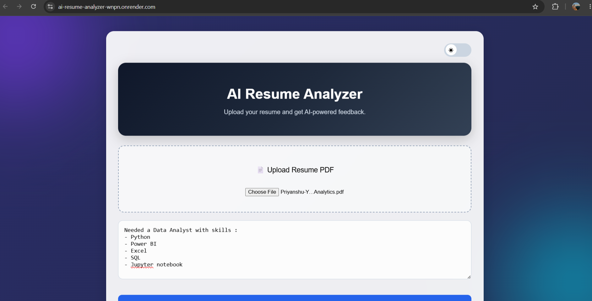
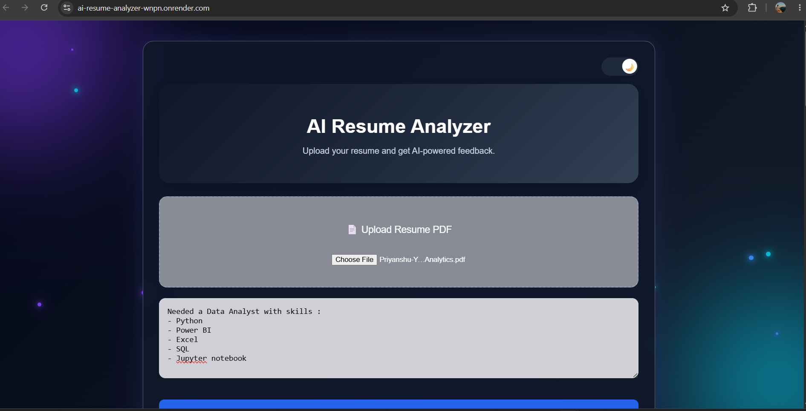
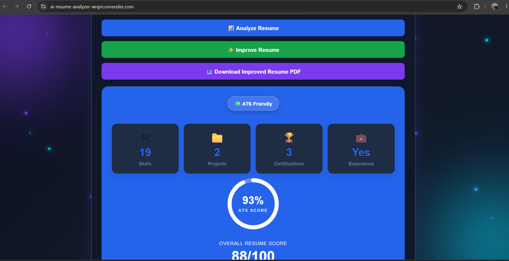
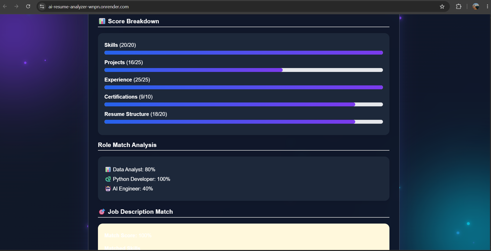
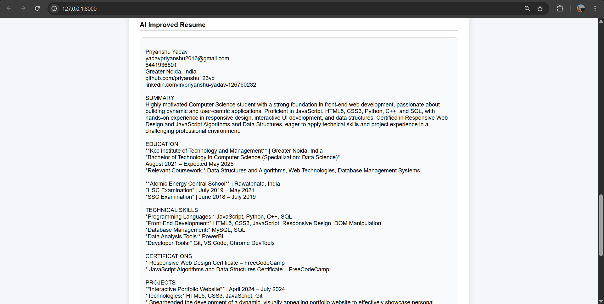

# AI Resume Analyzer

An AI-powered Resume Analyzer built using FastAPI, Google Gemini AI, and JavaScript. The application analyzes resumes, generates ATS-style feedback, evaluates role suitability, compares resumes against job descriptions, and provides AI-powered resume improvements.

## Live Demo

https://ai-resume-analyzer-wnpn.onrender.com

## Features

### AI Resume Analysis

* Upload PDF resumes
* Extract resume content using PyPDF
* Analyze resumes using Google Gemini AI
* Technical skills extraction
* Strength identification
* Weakness detection
* AI-generated improvement suggestions

### ATS Scoring System

* ATS Score (0–100)
* Resume Score (0–100)
* Resume Level Classification

  * Excellent
  * Good
  * Average
  * Needs Improvement

### Detailed Score Breakdown

* Skills Score
* Projects Score
* Experience Score
* Certifications Score
* Resume Structure Score

### Role Matching

Evaluate suitability for:

* Data Analyst
* Python Developer
* AI Engineer

### Job Description Matching

* Job Match Score
* Matched Skills Detection
* Missing Skills Analysis
* ATS Keyword Gap Identification

### AI Resume Improvement

* Resume rewriting using Gemini AI
* Strong action verbs
* ATS-friendly formatting suggestions
* Improved project descriptions
* Better professional summaries

### PDF Export

* Download AI-improved resume as PDF

### Modern User Interface

* Dark Mode / Light Mode
* ATS Circular Score Gauge
* Animated Background Effects
* Floating AI Particles
* Responsive Design
* Interactive Progress Bars

## Tech Stack

### Backend

* FastAPI
* Python
* Google Gemini API

### Frontend

* HTML
* CSS
* JavaScript

### Libraries

* PyPDF
* ReportLab
* Python Dotenv
* Python Multipart
* Jinja2

## System Architecture

Frontend (HTML/CSS/JavaScript)
↓
FastAPI Backend
↓
PDF Text Extraction
↓
Google Gemini AI
↓
JSON Response
↓
Interactive Dashboard

# Screenshots

### Home Page (Light Mode)

### Home Page (Dark Mode)

### Resume Analysis Dashboard

### Skills Extraction

### AI Resume Improvement

## API Endpoints

| Endpoint                  | Method | Description                  |
| ------------------------- | ------ | ---------------------------- |
| /upload-resume            | POST   | Analyze resume               |
| /improve-resume           | POST   | Generate improved resume     |
| /download-improved-resume | POST   | Download improved resume PDF |

## Future Enhancements

* Resume Section-wise Analysis
* Resume Template Suggestions
* Multiple Resume Comparison
* Interview Question Generation
* AI Career Guidance
* Resume Version History

## Author

Priyanshu Yadav

GitHub:
https://github.com/priyanshu123yd

Live Application:
https://ai-resume-analyzer-wnpn.onrender.com

