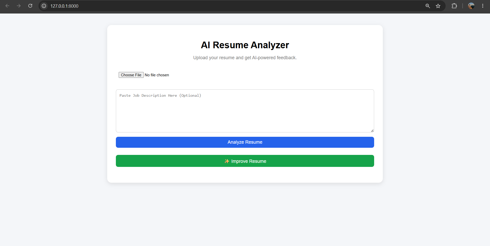
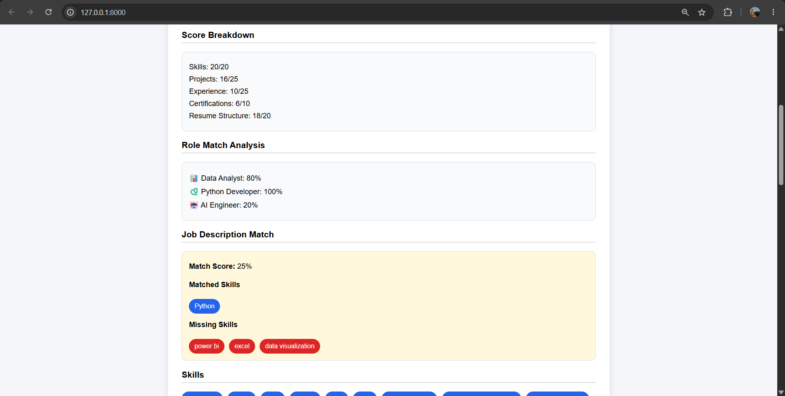

# AI Resume Analyzer

An AI-powered Resume Analyzer built with FastAPI and Google Gemini AI. Upload a PDF resume and receive detailed ATS-style feedback, resume scoring, role matching, job description matching, and AI-generated resume improvements.

## Features

### Resume Analysis

* Upload PDF resumes
* Extract text using pypdf
* Analyze resumes using Google Gemini AI
* Technical skills extraction
* Strengths identification
* Weakness detection
* Resume improvement suggestions

### Scoring System

* Resume Score (0–100)
* ATS Score Calculation
* Detailed Score Breakdown

  * Skills
  * Projects
  * Experience
  * Certifications
  * Resume Structure
* Resume Level Classification

  * Excellent
  * Good
  * Average
  * Needs Improvement

### Role Match Analysis

* Data Analyst Match %
* Python Developer Match %
* AI Engineer Match %

### Job Description Matching

* Match Score %
* Matched Skills Detection
* Missing Skills Identification
* ATS-style keyword gap analysis

### AI Resume Improvement

* AI-generated resume enhancement
* Improved wording and action verbs
* ATS-friendly resume recommendations

## Tech Stack

### Backend

* FastAPI
* Python
* Google Gemini AI

### Frontend

* HTML
* CSS
* JavaScript

### Libraries

* pypdf
* python-dotenv

## Screenshots

### Home Page

### Resume Analysis

### Job Description Match

### AI Resume Improvement

## Future Enhancements

* Download Improved Resume as PDF
* Resume Section Analysis
* Resume Keyword Gap Report
* Multiple Resume Comparison
* Resume Templates
* Cloud Deployment

## Author

Priyanshu Yadav
