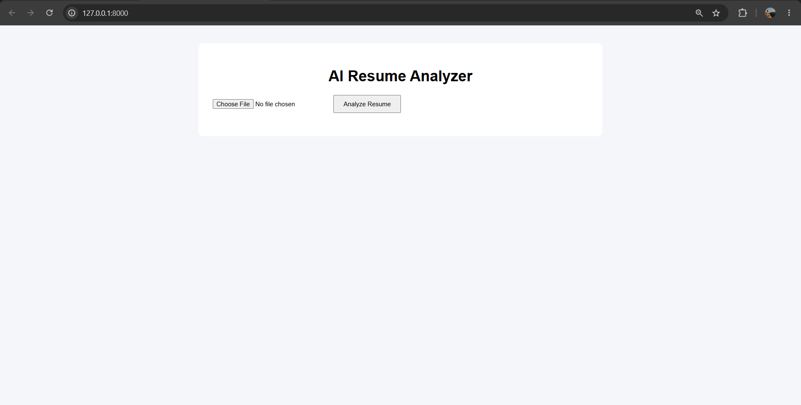

# AI Resume Analyzer

A FastAPI-based Resume Analyzer powered by Google Gemini.

## Features

## Features

* Upload PDF resumes
* Extract resume text using PyPDF
* Analyze resumes using Google Gemini AI
* Automatic technical skill extraction
* Resume Score calculation (0–100)
* ATS Score calculation
* Score Breakdown Analysis 
* Resume Level Classification (Excellent, Good, Average, Needs Improvement)
* Strength Detection
* Weakness Detection
* Personalized Improvement Suggestions
* Role Match Analysis:

  * Data Analyst Match
  * Python Developer Match
  * AI Engineer Match
* Dynamic Skill Badges UI
* FastAPI REST API Backend
* Responsive Frontend using HTML, CSS, and JavaScript
* Error Handling for invalid or scanned PDFs
* Git & GitHub Version Control

## Installation

pip install -r requirements.txt

Create a .env file:

GEMINI_API_KEY=YOUR_API_KEY

Run:

uvicorn resume_analyzer:app --reload

Open:

http://127.0.0.1:8000/docs

## Home Page

## Resume Analysis

